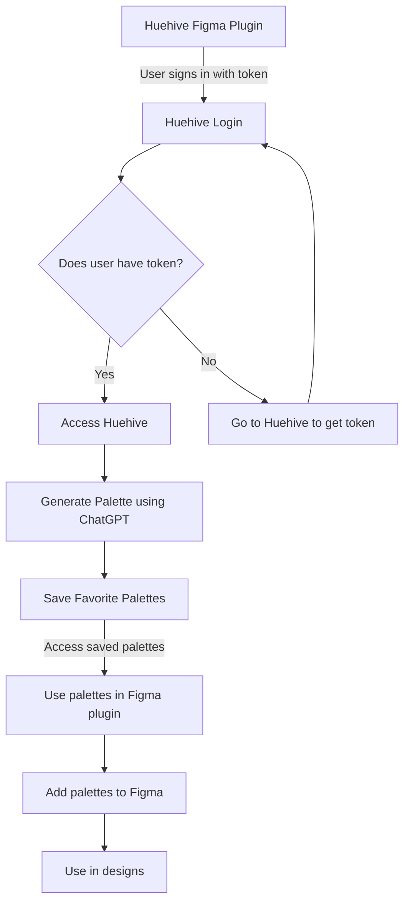

# HueHive Figma Plugin 


[Generated on Huehive](https://huehive.co/tools/diagrams)


This template contains the react example as shown on [Figma Docs](https://www.figma.com/plugin-docs/intro/), with some structural changes and extra tooling.

## Quickstart

- Run `yarn` to install dependencies.
- Run `yarn build:watch` to start webpack in watch mode.
- Open `Figma` -> `Plugins` -> `Development` -> `Import plugin from manifest...` and choose `manifest.json` file from this repo.

⭐ To change the UI of your plugin (the react code), start editing [App.tsx](./src/app/components/App.tsx).  
⭐ To interact with the Figma API edit [controller.ts](./src/plugin/controller.ts).  
⭐ Read more on the [Figma API Overview](https://www.figma.com/plugin-docs/api/api-overview/).

## Toolings

This repo is using:

- React + Webpack
- TypeScript
- Prettier precommit hook

## Development
* Clearing cache for the desktop app 
``` rm -rf "$HOME/Library/Application Support/Figma/"{Desktop,DesktopProfile} ```

Publishing plugin 
- https://help.figma.com/hc/en-us/articles/360042293394-Publish-plugins-to-the-Figma-Community#Publish_your_plugin
